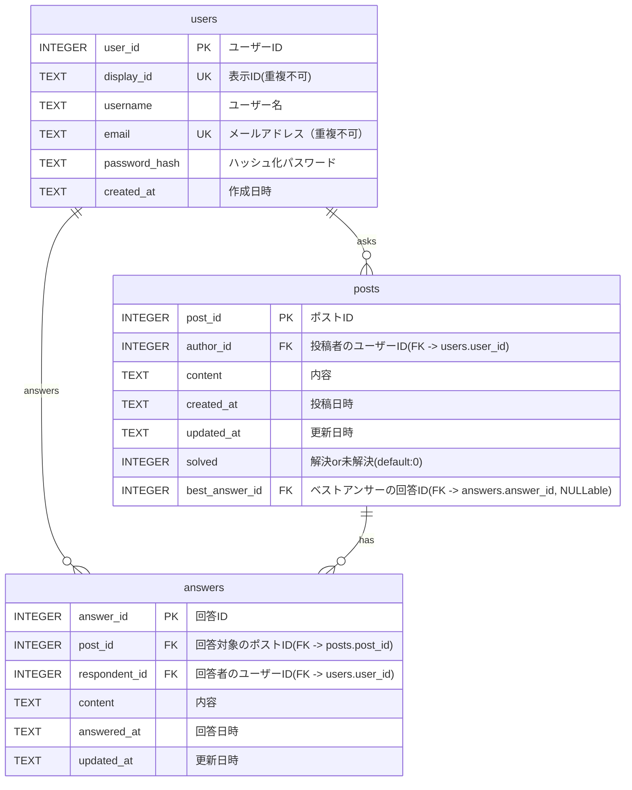

```mermaid
erDiagram

users {
        INTEGER user_id PK "ユーザーID "
        TEXT display_id UK "表示ID(重複不可)"
        TEXT username "ユーザー名"
        TEXT email UK "メールアドレス（重複不可）"
        TEXT password_hash "ハッシュ化パスワード"
        TEXT created_at "作成日時"
    }

posts {
    INTEGER post_id PK "ポストID"
    INTEGER author_id FK "投稿者のユーザーID(FK -> users.user_id)"
    TEXT content "内容"
    TEXT created_at "投稿日時"
    TEXT updated_at "更新日時"
    INTEGER solved "解決or未解決(default:0)"
    INTEGER best_answer_id FK "ベストアンサーの回答ID(FK -> answers.answer_id, NULLable)" 

}

answers {
    INTEGER answer_id PK "回答ID"
    INTEGER post_id FK "回答対象のポストID(FK -> posts.post_id)"
    INTEGER respondent_id FK "回答者のユーザーID(FK -> users.user_id)"
    TEXT content "内容"
    TEXT answered_at "回答日時"
    TEXT updated_at "更新日時"
}

users ||--o{ posts : "asks"
users ||--o{ answers : "answers"
posts ||--o{ answers : "has"
```